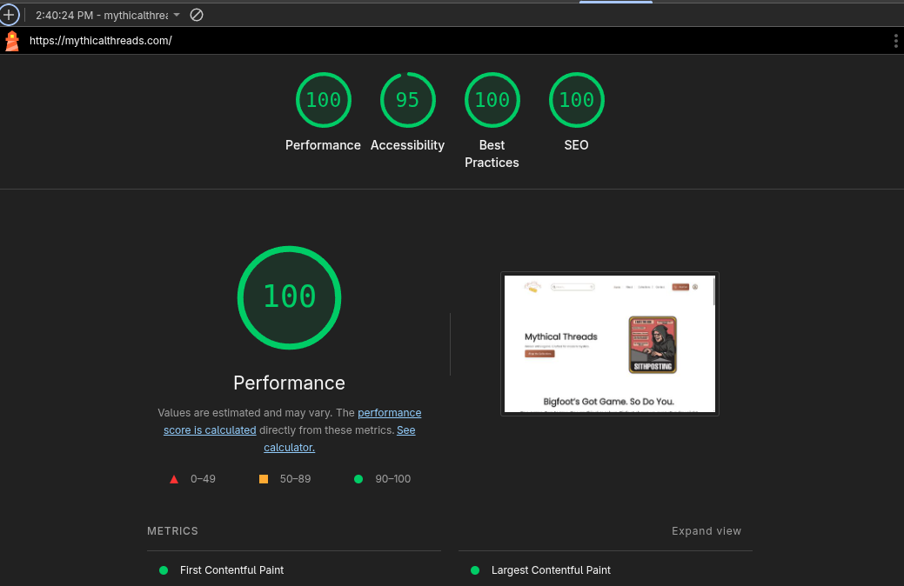

## 🛠 Technologies Behind the Project

The **Mythical Threads** website combines **static site generation** with modern commerce integrations for performance, scalability, and simplicity:

- **Astro.js** – Provides lightning-fast static site generation with partial hydration for an optimized browsing experience.
- **TypeScript** – Ensures type safety and maintainable code throughout the project.
- **TailwindCSS** – Delivers a clean, responsive, and modern design system tailored to e-commerce needs.
- **Snipcart** – Adds a flexible shopping cart and checkout flow with minimal overhead.
- **Stripe** – Powers secure and reliable payment processing worldwide.
- **PageCMS** – Enables simple, content-driven product and page management without complex setups.
- **Netlify** – Provides fast global deployment and serverless scalability.

---

## 🌟 Key Features

1. **Seamless Shopping Cart with Snipcart**

   - Users can **add products to their cart** and checkout without leaving the website.
   - Cart functionality is lightweight and integrates directly into the Astro pages.

2. **Secure Payments with Stripe**

   - Stripe ensures **PCI-compliant payment processing**.
   - Supports **major credit/debit cards** with easy future scalability for Apple Pay, Google Pay, and subscriptions.

3. **Performance-Driven Frontend**

   - Astro’s **islands architecture** makes pages load blazingly fast.
   - Optimized for **SEO, accessibility, and mobile devices**.

4. **Responsive Fashion Catalog**

   - Product pages showcase clothing with **clear imagery and details**.
   - TailwindCSS ensures **pixel-perfect responsiveness** across devices.

5. **Scalable & Future-Ready**
   - Easily extendable for **product categories, filtering, user accounts, or inventory management**.
   - Modular setup allows future CMS or headless backend integrations.

---

## 📊 Performance Insights

To ensure top-notch performance, accessibility, and SEO, the website was tested with **Google Lighthouse**:

---

## 🔗 Live Website

Check out the live store here: **[Mythical Threads](https://mythicalthreads.com/)**

## 📂 Repository

Explore the source code on GitHub: **[Mythical Threads Repository](https://github.com/mdejesus23/mythical-threads)**
